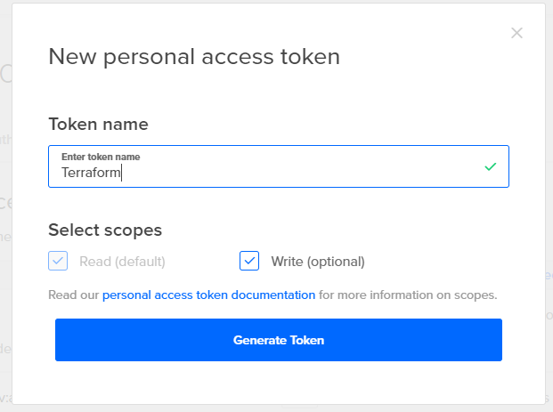
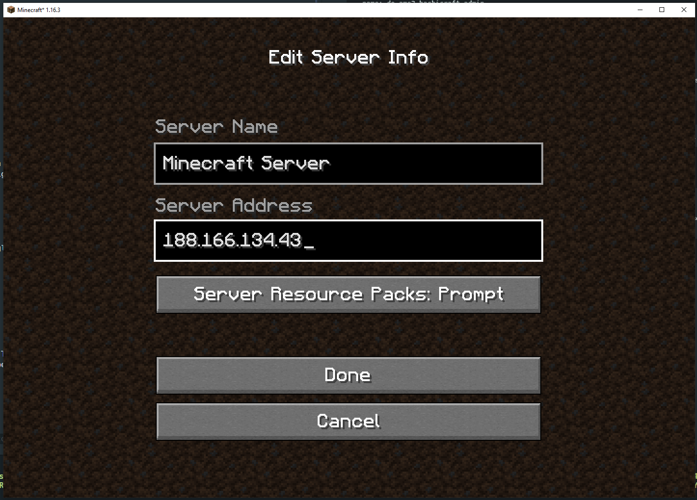
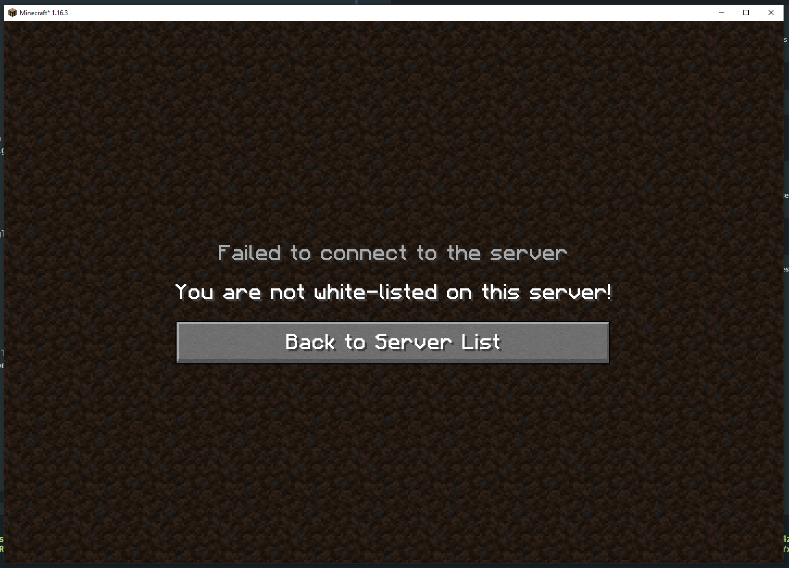

# Terraform Kubernetes Digital Ocean Deploy

Source repository for Digital Ocean deploy conference. This repository contains an example showing
how to create a Kubernetes cluster in Digital Ocean, and how to deploy applications to it using Terraform.

## Resources Created

- 1x DOKS cluster, single node `s-2vcpu-2gb`
- Minecraft running as a pod on the clsuter
- 1x External load balancer pointed at the Minecraft instance
- 1x 10GB volume attached to the Minecraft pod used for storing config
  and data.

## Setup

### Install Terraform

Terraform can be installed from the following link: [https://www.terraform.io/downloads.html](https://www.terraform.io/downloads.html)

### Obtain your Digital Ocean API Key and set it as an environment variable

- Visit the page:
  [https://cloud.digitalocean.com/account/api/tokens](https://cloud.digitalocean.com/account/api/tokens)

- Click Generate New Token:  
  

- Give the token a name, ensure Read and Write is set and click generate  
  

- Copy the the token (long string beneath the name) to your clip board  
  

- Create an environment variable using the token

```shell
export DIGITALOCEAN_TOKEN=c789eb2af98226de4f31582016b3eb83298a7a3baeb608310880936899a4a4d9
```

Terraform will automaticaly read the environment variable `DIGITALOCEAN_TOKEN` and use it
to communicate with the Digital Ocean API. NOTE: Ensure to keep this token private
do not add it to any files which may be uploaded to public souce code repositories like GitHub.

## Initialize Terraform

Before creating resources with Terraform you need to initialize the configuration, this downloads
any necessary dependencies and should only need to be done once. To do this run `terraform init`
in the current folder.

```shell
➜ terraform init

Initializing the backend...

Initializing provider plugins...
- Checking for available provider plugins...
- Downloading plugin for provider "kubernetes" (hashicorp/kubernetes) 1.13.2...
- Downloading plugin for provider "digitalocean" (terraform-providers/digitalocean) 1.22.2...


Warning: registry.terraform.io: For users on Terraform 0.13 or greater, this provider has moved to digitalocean/digitalocean. Please update your source in required_providers.


Terraform has been successfully initialized!

You may now begin working with Terraform. Try running "terraform plan" to see
any changes that are required for your infrastructure. All Terraform commands
should now work.

If you ever set or change modules or backend configuration for Terraform,
rerun this command to reinitialize your working directory. If you forget, other
commands will detect it and remind you to do so if necessary.
```

## Terraform apply

To create resources you can run a `terraform apply`, this will create the cluster and
the application. Before Terraform creates the cluster it will inform you of the changes
it is about to make. This is known as the Terraform plan. Before Terraform will actually
create the resources you need to answer `yes` that you approve the plan.

```shell
➜ terraform apply
An execution plan has been generated and is shown below.
Resource actions are indicated with the following symbols:
  + create

Terraform will perform the following actions:

  # digitalocean_kubernetes_cluster.minecraft will be created
  + resource "digitalocean_kubernetes_cluster" "minecraft" {
      + cluster_subnet = (known after apply)
      + created_at     = (known after apply)
      + endpoint       = (known after apply)
      + id             = (known after apply)
      + ipv4_address   = (known after apply)
      + kube_config    = (sensitive value)
      + name           = "hashicraft"
      + region         = "ams3"
      + service_subnet = (known after apply)
      + status         = (known after apply)
      + updated_at     = (known after apply)
      + version        = "1.19.3-do.2"
      + vpc_uuid       = (known after apply)

      + node_pool {
          + actual_node_count = (known after apply)
          + auto_scale        = false
          + id                = (known after apply)
          + name              = "worker-pool"
          + node_count        = 3
          + nodes             = (known after apply)
          + size              = "s-2vcpu-2gb"
        }
    }

  Enter a value: yes
```

Terraform will then start to create the cluster and provision the application to it,
this process will take a few minutes.

```shell
digitalocean_kubernetes_cluster.minecraft: Creating...
digitalocean_kubernetes_cluster.minecraft: Still creating... [10s elapsed]
digitalocean_kubernetes_cluster.minecraft: Still creating... [20s elapsed]
digitalocean_kubernetes_cluster.minecraft: Still creating... [5m50s elapsed]
digitalocean_kubernetes_cluster.minecraft: Creation complete after 5m52s [id=58b69edf-7cfa-4cea-969d-8adbf774a02e]
kubernetes_persistent_volume_claim.minecraftdata: Creating...
kubernetes_persistent_volume_claim.minecraftdata: Creation complete after 5s [id=default/minecraftdata]
kubernetes_deployment.minecraft: Creating...
kubernetes_deployment.minecraft: Still creating... [10s elapsed]
kubernetes_deployment.minecraft: Still creating... [30s elapsed]
kubernetes_deployment.minecraft: Creation complete after 36s [id=default/minecraft]
kubernetes_service.minecraft: Creating...
Kubernetes_service.minecraft: Still creating... [1m0s elapsed]
kubernetes_service.minecraft: Creation complete after 2m37s [id=default/minecraft]

Apply complete! Resources: 4 added, 0 changed, 0 destroyed.
```

Once the process has completed you will also see output information for your newly created cluster

```shell
Outputs:

k8s_config = apiVersion: v1
kind: Config
clusters:
- cluster:
    certificate-authority-data: LS0tLS1CRUdJTiBDRVJUSUZJQ0FURS0tLS0tCk1JSURKekNDQWcrZ0F3SUJBZ0lDQm5Vd0RRWUpLb1pJaHZjTkFRRUxCUUF3TXpFVk1CTUdBMVVFQ2hNTVJHbG4KYVhSaGJFOWpaV0Z1TVJvd0dBWURWUVFERXhGck9ITmhZWE1nUTJ4MWMzUmxjaUJEUVRBZUZ3MHlNREV4TVRBeApNelU1TURsYUZ3MDBNREV4TVRBeE16VTVNRGxhTURNeEZUQVRCZ05WQkFvVERFUnBaMmwwWVd4UFkyVmhiakVhCk1CZ0dBMVVFQXhNUmF6aHpZV0Z6SUVOc2RYTjBaWElnUTBFd2dnRWlNQTBHQ1NxR1NJYjNEUUVCQVFVQUE0SUIKRHdBd2dnRUtBb0lCQVFET2JOZ3FoSTRlWU1ZeDg2ekRORzJVZXFrSlEraEFyZWhQaW43d2E1cFQzYkxJUXVSTQpVamcvNW1KY29keUhKb2pQd3IvM2hsdmxGZWtOTzhLQ3RnNmZoSDVPZ000cnpYbE9WdHJkNmoxOTg4YndCbGdPCnJHTFJlWEdaNzJwR2JmbUtXU2pnd0c4ckY0eVBrOU16QVNzbEUxTC9VMEIzcllFeU0yNHV3dDhJaE5hSFl0aEMKV0dPU3pqd1RVS2NkRVRIN0RHU3pQaDB4MzRuaTdsZ29RNVkrTWNXaG0yT3JDU2h2WDhPeFRiWFc0ajBIaUhFVwpGQVBpZHpzNnBZUUFuUGlwOVVBTFVmQ2s3bnNmUHZieGd5dDdOWnNXWitTczdvQWZGVTI4R1FabnFUbDhKU21RCitnOCtURTVFOGJEems3WVZkTytibTBhbHVSVHNTOCtVL2Z2RkFnTUJBQUdqUlRCRE1BNEdBMVVkRHdFQi93UUUKQXdJQmhqQVNCZ05WSFJNQkFmOEVDREFHQVFIL0FnRUFNQjBHQTFVZERnUVdCQlQ0SW9RVUYrNFJ6c0dlMTNqZgozWG4zcy9PTFBqQU5CZ2txaGtpRzl3MEJBUXNGQUFPQ0FRRUFkYWVjdlA4RmkzN2dLV1o0NEVaZHltMDFyNXlnCmlPZlZhNTlEQUFhbEYwNVZCamFPdkkyN0JJRURFKzFvRlhpQzd6MzNESVk0RkgxaTY3aEZqaFpucEp1eFZibmMKdzJvazZYajJXcHZ2Wis3ZW9YTDFTSzJQazlZSHdXaUhSd0R0eDNjK0ZMZWppcUVoUW5FL29Eam5ObVRNOGxaaQpQMWpYMkpGYXlDV0Q5dkdtcTRMUUxPL280OXQxVDlOV2dsRndqZmtEUkFlVldXLzBWZU9CdmQvMWZtZXB6YU5nCk16dy9hSS8zWFBudWdEQmYzbGZmNVB3ZUYxWFZ6bkpIa3VMOHcrbzN2a0l2V2V1RmZVdVNZZlNTL2o5blZROWQKTCtaRnV6UGF1MkpzNVQ5M2RFVnpLMWJSRVRGMlo2U2RMV2tiQVRaSVZDQlRKaldYeTFudkRxMkVkQT09Ci0tLS0tRU5EIENFUlRJRklDQVRFLS0tLS0K
    server: https://58b69edf-7cfa-4cea-969d-8adbf774a02e.k8s.ondigitalocean.com
  name: do-ams3-hashicraft
contexts:
- context:
    cluster: do-ams3-hashicraft
    user: do-ams3-hashicraft-admin
  name: do-ams3-hashicraft
current-context: do-ams3-hashicraft
users:
- name: do-ams3-hashicraft-admin
  user:
    token: 94eecf801cd4e53cd5b61f54f94cb8b812891f25fe1cb8aec8ca48fa03567c6b

lb_address = 188.166.134.43
```

## Connecting to the cluster

To connect to the cluster you need to fetch a Kubernetes config file, Terraform allows the definition of output
variables which contain data from the created resources. The `k8s_config` variable contains the config needed
to connect to the cluster. You can output this to a file using the following command:

```
terraform output -raw k8s_config > kubeconfig.yaml
```

Then you can use `kubectl` as normal to connect to the cluster, running get pods will show you a single pod
running.

```
➜ KUBECONFIG=$PWD/kubeconfig.yaml kubectl get pods
NAME                         READY   STATUS    RESTARTS   AGE
minecraft-66988b7999-wgm5k   1/1     Running   0          7m39s
```

## Connecting to the Minecraft server

As an example application a Minecraft server has been deployed as a pod to your Kuberenetes cluster. To
access the server an external loadbalancer has been created. The address for this load balancer can be
retrieved by again querying Terraform output variables.

```
terraform output lb_address
188.166.134.43
```

Let's now use this to connect to the server, if you open Minecraft and add a new Multiplayer server
using the IP Address from the Terraform variable.



You will see that while it allows you to connect you are not allowed to access the server, this is
because of Minecrafts security settings which does not allow unauthorized users. Let's see how you
can add authorization to access the server.



You can add access by using the `rcon-cli` inside the Minecraft container, use the following command
to get shell access to the container.

```
KUBECONFIG=$PWD/kubeconfig.yaml kubectl exec -it \
  $(kubectl get pods -l app=minecraft -o=jsonpath='{.items[0].metadata.name}') \
  bash
```

You can then start the `rcon-cli`:

```
root@minecraft-66988b7999-wgm5k:/minecraft# rcon-cli
```

And run the command `/whitelist YOURUSERNAME`, my user is `sheriffjackson` so I used the following
command:

```
> /whitelist add sheriffjackson
Added SheriffJackson to the whitelist
```

Once you have whitelisted your user you can now log into the server.


## Cleaning up and Destroying resources

To clean up all resource created you can use the `teraform destroy` command.

```
➜ terraform destroy
digitalocean_kubernetes_cluster.minecraft: Refreshing state... [id=58b69edf-7cfa-4cea-969d-8adbf774a02e]
kubernetes_persistent_volume_claim.minecraftdata: Refreshing state... [id=default/minecraftdata]
kubernetes_deployment.minecraft: Refreshing state... [id=default/minecraft]
kubernetes_service.minecraft: Refreshing state... [id=default/minecraft]

An execution plan has been generated and is shown below.
Resource actions are indicated with the following symbols:
  - destroy

Terraform will perform the following actions:

  # digitalocean_kubernetes_cluster.minecraft will be destroyed
  - resource "digitalocean_kubernetes_cluster" "minecraft" {
      - auto_upgrade   = false -> null
      - cluster_subnet = "10.244.0.0/16" -> null
#...

Do you really want to destroy all resources?
  Terraform will destroy all your managed infrastructure, as shown above.
  There is no undo. Only 'yes' will be accepted to confirm.

  Enter a value: yes

kubernetes_service.minecraft: Destroying... [id=default/minecraft]
kubernetes_service.minecraft: Destruction complete after 3s
kubernetes_deployment.minecraft: Destroying... [id=default/minecraft]
kubernetes_deployment.minecraft: Still destroying... [id=default/minecraft, 10s elapsed]
kubernetes_deployment.minecraft: Still destroying... [id=default/minecraft, 20s elapsed]
kubernetes_deployment.minecraft: Still destroying... [id=default/minecraft, 30s elapsed]
kubernetes_deployment.minecraft: Destruction complete after 36s
kubernetes_persistent_volume_claim.minecraftdata: Destroying... [id=default/minecraftdata]
kubernetes_persistent_volume_claim.minecraftdata: Destruction complete after 0s
digitalocean_kubernetes_cluster.minecraft: Destroying... [id=58b69edf-7cfa-4cea-969d-8adbf774a02e]
digitalocean_kubernetes_cluster.minecraft: Destruction complete after 1s

Destroy complete! Resources: 4 destroyed.
```

This command removes the cluster, loadbalancer and volume created with `apply`. You can run `terraform apply`
at any time to re-create your cluster.
